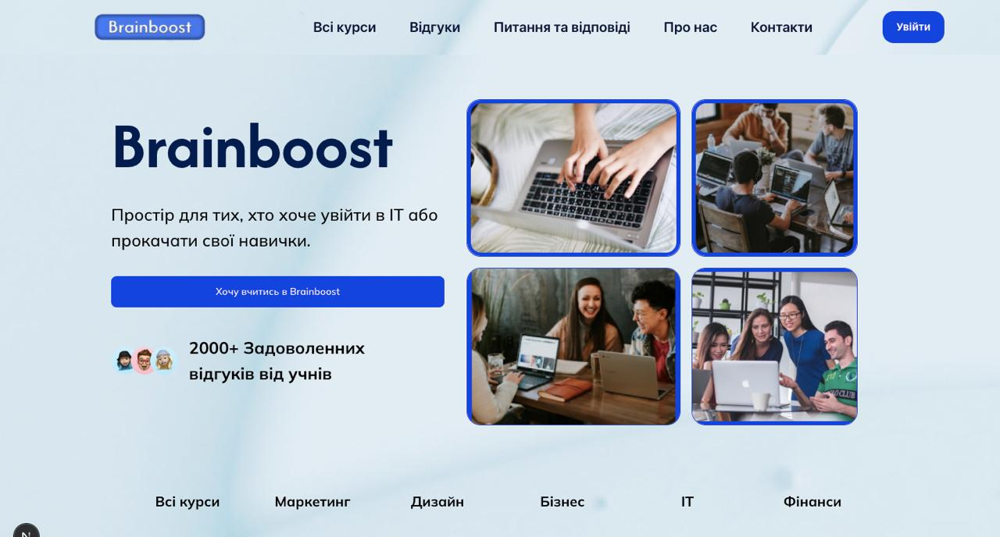
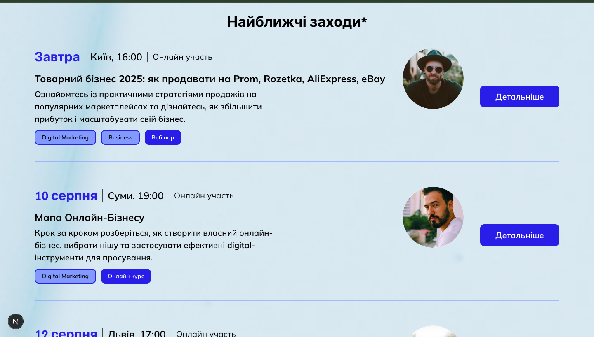
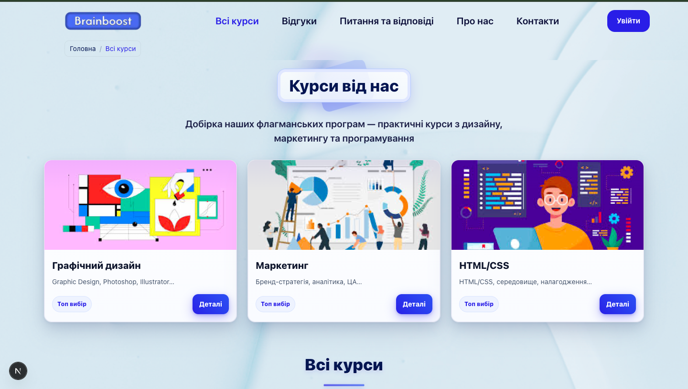
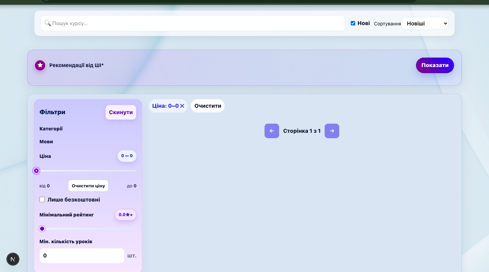
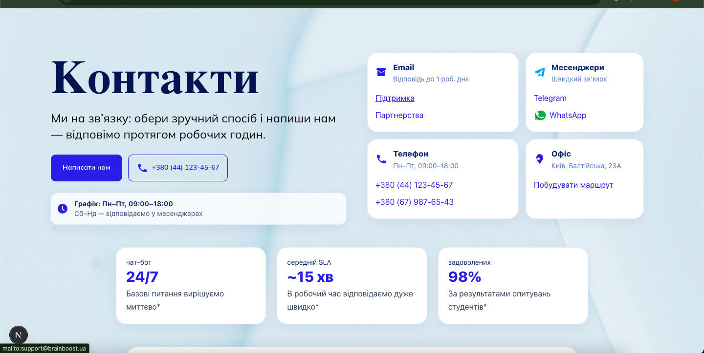
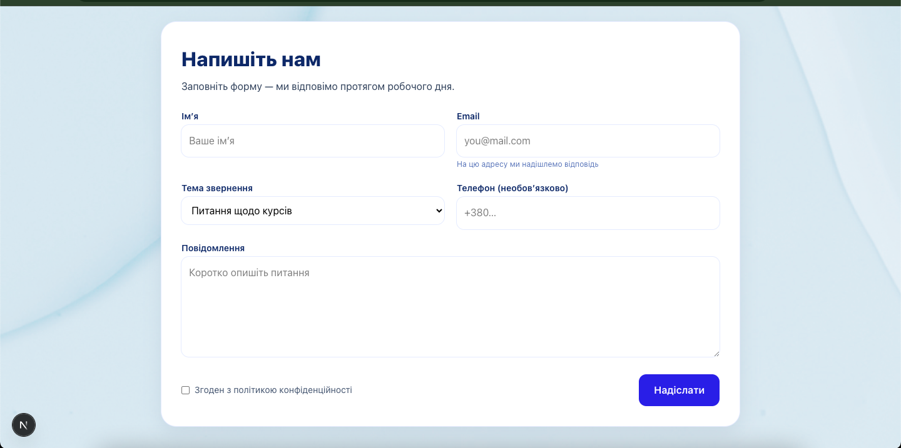
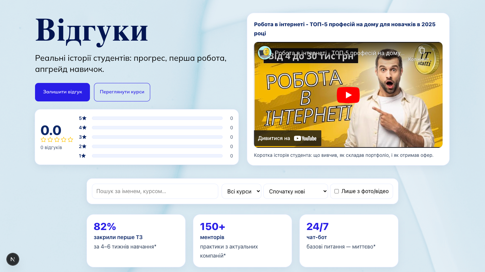
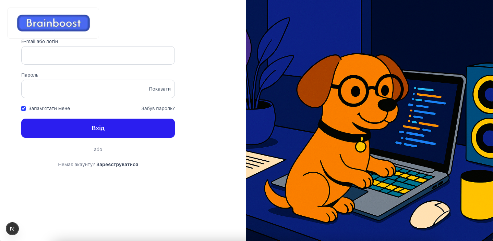

# BrainBoost — Educational Platform (Diploma Project) | Case Study

> **BrainBoost** is an online learning platform (Genius Space–like) where **students** can browse and buy courses, learn lessons, pass tests, and leave reviews; **teachers** can create and manage courses/lessons/tests and analyze student results; **admins** can moderate and manage the platform.

📍 **Project type:** Diploma / Academic team project  
🧩 **My contribution:** ~40% of overall implementation, ~80% of UI/UX layout & design.  
🌍 **UI language:** Ukrainian (student version). Key flows and features are explained in English here.

---

## Table of Contents
- [Project Idea](#project-idea)
- [Goal & Relevance](#goal--relevance)
- [Target Audience](#target-audience)
- [Roles & Permissions](#roles--permissions)
- [Core User Flows](#core-user-flows)
- [Key Features](#key-features)
- [Tech Stack](#tech-stack)
- [Architecture Overview](#architecture-overview)
- [Database & Data Model](#database--data-model)
- [Authentication & Security](#authentication--security)
- [Testing System](#testing-system)
- [Teacher Dashboard & Analytics](#teacher-dashboard--analytics)
- [Admin Panel](#admin-panel)
- [UI/UX & Design](#uiux--design)
- [Deployment](#deployment)
- [Screenshots](#screenshots)
- [My Responsibilities](#my-responsibilities)
- [Challenges & Solutions](#challenges--solutions)
- [Roadmap / Improvements](#roadmap--improvements)
- [Credits](#credits)

---

## Project Idea
BrainBoost is a **full-featured educational platform** for publishing and completing courses in different areas.  
It aims to be convenient for:
- learners who want structured courses and measurable progress,
- teachers/authors who want tools to create content and track results,
- admins who need moderation and platform control.

---

## Goal & Relevance
**Goal:** build a modern, user-friendly platform for online learning.

**Why relevant:** with digitalization and growth of remote learning and self-education, platforms that are easy for both students and teachers are in high demand.

---

## Target Audience
- **Students (16+):** anyone who wants to learn (no location restrictions)
- **Teachers/Authors:** users with proven qualification/skills to publish and teach

---

## Roles & Permissions
### Guest (Public)
- Browse course catalog
- Filters, search, sorting
- View course details: description, author, rating, reviews, price
- View static pages: About / Contacts / FAQ
- Register / Login

### Student
- Buy courses
- Access “My courses”
- Learn lessons (theory pages)
- Start and pass tests
- View attempt history
- Profile management

### Teacher
- Teacher dashboard
- Create/edit own courses
- Manage lessons (theory content, ordering)
- Create/edit tests
- View student attempts & results for own courses

### Admin
- Admin panel
- Full CRUD for courses/users/categories/reviews
- Moderation of reviews
- Platform management

---

## Core User Flows
### Public flows
- `/courses`  
  Catalog with **filters** (category, language, rating, price), **search**, **sorting**
- `/courses/[slug|id]/details`  
  Course page with description, author, rating, reviews, price, purchase CTA
- Auth:
  - **3-step registration**: role → personal data → date of birth
  - login
  - password reset
  - email verification via email

### Student flows
- Purchase:
  - `/checkout/[courseId]` → creates `PurchasedCourse`
- Learning:
  - `/learn/[courseId]/[lessonId]`
- Testing:
  - start test → submit answers → get result → store attempts/history
- Profile:
  - view/edit personal data
  - purchased courses list

### Teacher flows
- `/teacher` dashboard
- Courses:
  - create/edit (title, description, price, image, category, language, topic, slug)
- Lessons:
  - theory content (text + images/video), ordering
- Tests:
  - question types: Single-choice, Multi-choice, True/False, Text answer
  - time limit, pass threshold
- Results:
  - view aggregated attempts + details per student/course

### Admin flows
- `/admin` panel
- Moderate reviews
- Manage categories, users, courses
- Full CRUD and moderation features

---

## Key Features
### Course Catalog
- Filtering: category, language, rating, price
- Search by name/title
- Sorting (e.g., rating, price, newest)
- Course cards with preview information

### Course Details
- Full description/syllabus
- Teacher/author info
- Rating and reviews
- Price
- Purchase CTA

### Purchase & Access Control
- Purchase flow creates a “purchased” record
- Only students who purchased can access lessons/tests

### Learning Experience
- Lesson pages with structured theory
- Media support (images/videos where applicable)
- Ordered navigation between lessons

### Reviews & Ratings
- Students can leave rating + comment after completing
- Edit/delete own comments
- Change rating later

---

## Tech Stack
### Frontend
- **Next.js** (TypeScript)
- Responsive UI
- Role-based routing/pages (public, student, teacher, admin)

### Backend
- **Django + Django REST Framework**
- REST API for catalog, auth, purchases, learning content, tests, attempts, reviews
- Role-based permissions

### Database
- **SQLite** (student version)

### DevOps / Infrastructure
- **Docker + Docker Compose**
- **Ubuntu VPS** (private cloud) with SSH access
- **Nginx** as reverse proxy
- DNS provider: **nic.ua**
- Version control: Git (GitHub/GitLab)
- Task management: Trello
- Design: Figma (plus Adobe Premiere for media/demo)

---

## Architecture Overview
High-level architecture:

- **Next.js Frontend**
  - Pages for public catalog, course details
  - Auth flows
  - Student learning/test pages
  - Teacher dashboard
  - Admin panel UI (if applicable)

- **Django REST API**
  - Auth + roles
  - Courses, categories, lessons, tests
  - Purchases & access rules
  - Reviews/ratings moderation
  - Attempts & analytics

- **Database (SQLite)**
  - Users and roles
  - Course structure and metadata
  - Lesson content
  - Test questions/answers
  - Attempts history
  - Purchases and permissions
  - Reviews/ratings

---

## Database & Data Model
Core entities (conceptual):
- **User** (role: guest/student/teacher/admin)
- **Course** (author, category, language, price, rating, slug)
- **Lesson** (course, order, theory content, media)
- **Test**
- **Question** (MC single, MC multi, True/False, Text)
- **Answer** / variants for each question type
- **Attempt** (student, test, score, result, timestamp)
- **PurchasedCourse** (student, course, purchase metadata)
- **Review** (student, course, rating, comment, moderation status)
- **Category**

> Note: exact model names may differ in code; this is a platform-level view.

---

## Authentication & Security
- **Email + password** auth
- **Email verification** via email message link/token
- **Password reset**
- Role-based permissions:
  - guests can only browse
  - students need purchase to access learning/tests
  - teachers can manage only their own courses
  - admins have full access and moderation rights

Security considerations:
- secrets stored in environment variables (not in repo)
- backend permissions check all “write” operations
- purchase/access control validated on server side

---

## Testing System
Supported question types:
1. **Multiple Choice (Single correct)**
2. **Multiple Choice (Multiple correct)**
3. **True / False**
4. **Text answer** (free text)

Test configuration:
- **Time limit**
- **Pass threshold**
- Attempts stored with:
  - score
  - pass/fail result
  - timestamp
  - answer breakdown (if implemented)

Student can:
- start a test
- submit answers
- immediately see result (if allowed)
- view attempt history later

---

## Teacher Dashboard & Analytics
Teacher features:
- list of own courses
- CRUD for courses
- manage lessons ordering and content
- create/edit tests and questions
- view student attempts:
  - aggregated performance per course
  - attempt details per student/test
  - progress insights (where available)

---

## Admin Panel
Admin capabilities:
- manage users (CRUD)
- manage courses and categories
- moderate reviews/comments
- enforce platform rules and content quality

---

## UI/UX & Design
Design process:
- UI layouts and components were designed in **Figma**
- Focus areas:
  - clean catalog browsing
  - clear course details page
  - understandable learning/test flow
  - teacher tools for creating content
  - admin moderation UX

**My UI contribution:** ~80% of overall UI/UX and front-end layout implementation.

---

## Deployment
Deployment approach (student version):
- VPS on Ubuntu with SSH access
- Docker Compose for services
- Nginx for routing/reverse proxy
- DNS via nic.ua

Typical flow:
1. configure `.env` files
2. build & run containers
3. apply migrations
4. serve backend API + frontend app behind nginx

## Demo

- **Video walkthrough (UA):** https://youtu.be/fHjqRSJaSEE  
  > Short demo in Ukrainian. Core features and flows are described in English in this README.

---

## Screenshots

### Public pages
- **Home page (hero section)** — platform positioning and main CTA  
  

- **Upcoming events/webinars** — event listing with tags and “Details” CTA  
  

- **Featured courses section** — course cards + categories  
  

- **Courses catalog (filters/search/sorting)** — empty-state UI  
  

### Support & community
- **Contacts page** — support channels, office info, quick actions  
  

- **Contact form** — topic selection, email/phone, message, consent checkbox  
  

- **Reviews page** — rating breakdown, filters, embedded media/story section  
  

### Authentication
- **Login page UI**  
  

> Note: Authentication is not accessible in the current demo build (UI implemented; backend connection/configuration pending).

## My Responsibilities
In this team diploma project, I contributed significantly to both engineering and design:

- Implemented ~50% of platform functionality (front-end + related integration)
- Designed and built ~80% of UI/UX layouts based on Figma
- Worked on core pages and flows:
  - catalog browsing, course details UI
  - responsive layouts
  - user journeys (student/teacher/admin)
- Collaborated with teammates on feature splitting and integration
- Participated in planning and task management (Trello)
- Helped with deployment approach (Docker/Nginx/VPS) where applicable

---

## Challenges & Solutions
- **Role complexity** (guest/student/teacher/admin)  
  → implemented clear separation of routes and permissions (server-side checks)

- **Testing system variability** (MC/TF/Text)  
  → structured question types and standardized attempt storage

- **Access control after purchase**  
  → protected learning and testing endpoints with purchase validation

- **Time constraints of diploma project**  
  → prioritized core learning and teacher flows; localization and polish were planned for later

---

## Roadmap / Improvements
If continuing the project, the next best improvements would be:
- Full localization (EN + UA)
- Replace SQLite with Postgres for production
- Improve UI consistency and accessibility
- Add richer analytics for teachers (charts, progress trends)
- Add certificates/badges and achievements system
- Add payments integration for real-world checkout
- Add notifications (email/in-app) for course updates and results
- Automated tests (unit/integration/e2e)

---

**Tools used:** Next.js, TypeScript, Django REST Framework, SQLite, Docker/Compose, Nginx, Ubuntu VPS, Git, Trello, Figma.

If you want to contact me:
- LinkedIn: <add-link>
- GitHub: <add-link>
- Email: <4896998@gmail.com>
